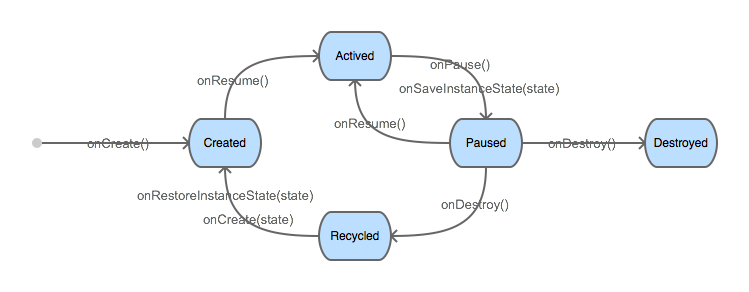

# Interaction Lifecycle 交互生命周期

As a user navigates through, out of, and back to your App, the interaction instances in a your app transition between different state in their life cycle. During lifecycle state transition, Staple framework calls a series of lifecycle callbacks in which you set up the user interface and other components.

当用户在多个交互之间导航、后退或者离开你的应用时，交互会在它的生命中期中转换不同的状态。在状态转换的过程中，Staple会调用交互的一系列生命周期函数，通过这些方法，你可以设置用户界面和其他组件。

## Overview 概述

There are five interaction lifecycle states: Created, Actived, Paused, Recycled and Destroyed. and there are six lifecycle callbacks will be invoke during state transition: onCreate(), onRestoreInstanceState(), onResume(), onPause(), onSaveInstanceState() and onDestroy(). The following chat shows how it works:

交互一共有5个生命周期状态：创建（Created）、活动（Actived）、暂停（Paused）、回收（Recycled）和销毁（Destroyed）。在生命周期状态的转换过程中，有6个生命周期函数会被调用：onCreate()、onRestoreInstanceState()、onResume()、onPause()、onSaveInstanceState()和onDestroy()。下图展示了交互的生命周期如何转换：

## "Created" and "Actived" “创建”与“活动”

When a new interaction is started, Staple creates a new interaction instance and set its lifecycle state to "Created". Then, it will be pushed into the interaction stack. It will instantly transit to "Actived" state and can interact with the user since it is at the top of the stack.

当一个新的交互被启动时，Staple框架会创建一个实例，并将它置于“创建”状态。随后，它被压入交互堆栈，由于处在堆栈的顶部，它会被立即显示出来并可以与用户进行互动，这样它便转换到了“活动”状态。

## "Paused" and "Destroyed" “暂停”与“销毁”

When an "Actived" interaction is going to leave users' sight, it will be transt to "Paused" state. In this state, users can not see or interact with it. Usually there are two situations: another new interaction is started or current interaction was finish by user. In first situation, interaction will remain in the stack and waiting to get to the top of the stack again; In second situation, interaction will be destroyed and transited to "Destroyed" state. Strictly, "Destroyed" is not a state, because every thing is gone.

当有一个“活动”交互即将离开用户视线，那么这个交互就会转换到“暂停”状态，用户无法看见这个交互并与之互动。通常这有两种可能：另一个新的交互被开启，或是用户结束了这个交互。如果是前者，那么交互会继续留在交互堆栈中，等待再次回到堆栈顶部；如果是后者，交互就会被销毁从而转换到“销毁”状态，严格来说销毁不是一种状态，因为交互实例都已经不存在了。

## "Recycled" and "Created" “回收”与“创建”

If there are too many "Paused" interactions in the interaction stack, Staple will release the instance of the interaction which at the bottom of the stack to reduce memory usage, but it's state will ramin in the stack. This state is call "Recycled". A similar situation also occurs when user refreshes the web page or navigates to another website. In this situation, all interaction instances are released, but Staple will keep their states.

如果交互堆栈中的“暂停”交互数量过多，Staple会释放处于堆栈最底部的交互实例来降低内存占用，但它的相关状态信息仍然在交互堆栈中，这种生命周期状态就是“回收”状态了。类似的情况还发生在用户刷新页面或从Staple应用导航到其他的网页时，那时所有的交互的实例都释放了，但是交互状态仍然保留在Staple的交互堆栈中。

When a "Recycled" interaction get back to the top of the interaction stack, Staple will re-create an instance of this interaction and restore its state as described in previous chapter. The interaction lifecycle state will be set to "Created" then transit to "Actived".

当处于“回收”状态的交互重新回到堆栈顶部时，Staple会重建这个交互的实例，并像前一章描述的那样恢复实例的状态，使交互重新转换到“创建”状态，随后再转换到“活动”状态。

- - -

**[NEXT: I18N SUPPORT 支持国际化](i18n-support.md)**